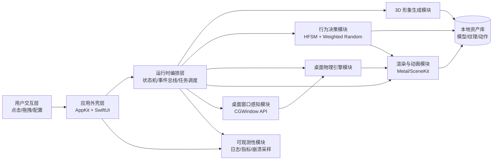
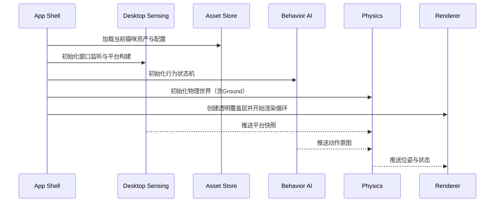

# macOS 桌面虚拟猫咪应用技术架构

## 1. 文档目标
本文档基于 `prd.md`，定义桌面虚拟猫咪应用的可落地技术架构，覆盖：
- 系统分层与核心模块
- 技术栈建议与选型理由
- 关键业务流程与数据流
- 性能、兼容性、稳定性约束的工程实现策略

---

## 2. 约束与设计原则

### 2.1 业务约束
- 仅支持 macOS 12.0+
- 支持 Intel 与 Apple Silicon
- 虚拟猫咪常驻桌面上层（非全屏场景）
- 与桌面窗口产生平台级物理交互
- 支持用户上传猫咪图片并生成可动 3D 形象
- 完全离线可用：核心功能不依赖任何网络服务
- 应用删除后数据不可恢复：所有业务数据仅保存在应用私有目录
- 宠物活动逻辑完全随机：不使用固定行为脚本、固定路线或固定时间表

### 2.2 非功能约束
- CPU 平均占用 <= 5%
- 内存占用 <= 200MB
- 长时间运行稳定，无明显卡顿或崩溃
- 对笔记本续航影响可控

### 2.3 架构原则
- 纯本地运行：图像处理、3D 生成、行为与渲染全部在端侧完成
- 分层解耦：渲染、物理、行为、系统集成分离
- 事件驱动：窗口变化、用户输入、动画状态以事件总线联动
- 性能预算化：按模块设定 CPU/GPU/内存预算与降级策略

---

## 3. 总体架构



---

## 4. 分层与模块设计

## 4.1 应用外壳层（Shell）
职责：
- 应用生命周期管理（启动、前后台、桌面切换）
- 设置面板与猫咪形象管理 UI
- 管理覆盖层窗口（Overlay Window）

建议技术：
- `AppKit`：窗口层级、桌面空间、系统事件集成
- `SwiftUI`：设置界面、上传向导、参数微调界面

关键实现点：
- 使用无边框透明窗口作为渲染宿主
- 非交互区域开启鼠标穿透，避免影响用户正常操作
- 检测全屏应用状态，自动隐藏或迁移显示策略

## 4.2 桌面窗口感知模块（Desktop Sensing）
职责：
- 获取当前屏幕中可见窗口几何信息
- 将窗口顶部边缘抽象为可站立平台
- 监听窗口位置/尺寸/层级变化并增量更新平台图

建议技术：
- `CGWindowListCopyWindowInfo`
- `AXObserver`（可选，用于更细粒度窗口变化监听）

输出数据结构（示例）：
- Platform(id, x, y, width, type=window|ground, velocity)
- PlatformGraph(nodes, edgesByJumpReachability)

## 4.3 桌面物理引擎模块（Physics）
职责：
- 重力、速度、加速度积分
- 起跳、落地、碰撞、滑落判定
- 跳跃失败与摔倒/翻滚缓冲动作触发

建议技术：
- 轻量自研 2.5D 运动学层（优先）
- 与 3D 渲染解耦，物理只输出姿态与轨迹

核心机制：
- 固定时间步长（例如 60Hz 物理 Tick）
- 屏幕底边常驻 Ground 平台
- 窗口顶边为离散平台
- 可达性判定：结合猫体型参数、最大起跳速度、落差容忍

## 4.4 行为决策模块（Behavior AI）
职责：
- 在空闲、探索、互动、休息、跑酷等状态间进行随机切换
- 基于随机采样选择下一动作与下一目标平台
- 在随机前提下满足物理可达与边界约束，维持“真实猫咪感”

建议技术：
- 分层状态机（HFSM）+ 随机策略引擎（Weighted Random）
- 随机种子与冷却表（Cooldown Table），避免短时间重复同一动作

行为输入：
- 平台可达性、动作冷却状态、随机种子、用户交互事件

行为输出：
- 高层随机意图（WalkToPlatform、JumpToTarget、Groom、Sleep、RunParkour）

随机策略规则（关键约束）：
- 每个决策 Tick 从候选动作池随机采样，不使用固定顺序脚本
- 过滤不可行动作（不可达平台、越界风险、物理失败概率过高）
- 对最近执行动作施加冷却惩罚，降低重复概率
- 用户交互发生后，立即触发一次随机重采样

## 4.5 渲染与动画模块（Render/Animation）
职责：
- 3D 模型渲染、骨骼动画播放
- 动作混合与过渡（Blend Tree）
- 与物理轨迹同步（根运动校正）

建议技术：
- `Metal` + `SceneKit`（工程效率优先）
- 后续可演进为纯 `Metal` 渲染管线（性能优先）

关键策略：
- 动画状态机与行为状态机解耦
- 通过 IK/姿态修正增强落地与起跳真实感
- 低电量模式下降低阴影/后处理质量

## 4.6 3D 形象生成模块（Avatar Generation）
职责：
- 接收单张/多张猫咪照片
- 执行特征提取（毛色、花纹、脸型、体态）
- 生成可编辑的 3D 虚拟猫咪资产

建议实现形态：
- V1：纯本地方案（规则模板拟合 + 轻量端侧模型）
- V2：纯本地增强方案（更高精度端侧模型与细节重建）

子流程：
1. 图片质量检测与角度覆盖评估
2. 关键特征提取与参数化
3. 基础模板拟合（Mesh + Fur Texture）
4. 用户微调（滑杆与预览）
5. 资产落盘与版本管理

资产产物：
- mesh.glb / skeleton / fur-texture / material-profile / behavior-profile

## 4.7 资产与配置模块（Asset & Config）
职责：
- 存储模型、纹理、动作片段、参数配置
- 管理多只猫咪档案与版本
- 提供快速加载与缓存淘汰策略

建议：
- 本地文件 + SQLite 元数据
- 资源分级加载（启动只加载当前猫咪必需资源）

落盘策略（满足卸载即清空）：
- 所有用户数据仅落盘到应用容器私有目录（Application Support / Caches / tmp）
- 禁止写入用户公共目录（Desktop、Documents）与外部数据库
- 不启用任何云同步、账号体系、远程备份
- 缓存与中间产物统一登记，便于运行期清理和卸载后由系统一并删除

## 4.8 可观测性与稳定性模块（Observability）
职责：
- 性能指标采集（CPU、内存、帧时间）
- 异常日志、崩溃采样、动作失败统计
- 线上问题定位与版本回归分析

建议技术：
- `os_log` + 自定义指标上报
- 关键路径埋点（生成、加载、跳跃、窗口扫描）

---

## 5. 核心运行时流程

## 5.1 启动流程


## 5.2 窗口平台更新流程
1. 定时或事件触发获取可见窗口集合
2. 过滤不可用窗口（最小化、全屏遮挡、系统保留窗口）
3. 生成平台节点并更新可达跳跃边
4. 若当前目标平台失效，行为模块重规划

## 5.3 用户互动流程
1. 用户点击/拖拽猫咪
2. 输入系统生成 InteractionEvent
3. 行为模块触发随机重采样，切换到新的响应行为
4. 动画模块执行过渡，物理模块同步姿态

---

## 6. 性能与资源预算设计

## 6.1 预算拆分（目标）
- Desktop Sensing: CPU <= 1.0%
- Behavior + Physics: CPU <= 1.5%
- Render + Animation: CPU/GPU 折算 <= 2.0%
- 其他后台任务: CPU <= 0.5%

总目标：平均 CPU <= 5%

## 6.2 内存预算（目标）
- 模型与纹理：80MB
- 动画与状态缓存：40MB
- 渲染缓冲与中间资源：40MB
- 应用与日志等其他：40MB

总目标：内存 <= 200MB

## 6.3 关键优化策略
- 物理固定步长 + 渲染可变帧率解耦
- 窗口扫描降频（事件优先，轮询兜底）
- 动画 LOD 与纹理分辨率分级
- 低功耗模式自动降帧（例如 60fps -> 30fps）
- 后台或不可见场景降低计算频率

---

## 7. 兼容性与系统集成

## 7.1 macOS 版本与芯片
- 支持 macOS 12+
- 构建 Universal Binary（x86_64 + arm64）

## 7.2 权限与安全
- 最小权限原则，仅在需要时请求系统能力
- 用户图片本地加密存储（可选）

## 7.4 数据生命周期与卸载清除
- 数据创建：仅在本地生成并保存猫咪资产、参数、日志与缓存
- 数据使用：仅本机进程可读写，不上传、不镜像、不同步
- 数据删除：应用内提供“一键清空本地数据”能力（删除资产库、数据库、缓存、日志）
- 卸载清除：所有业务数据位于应用私有目录，应用被删除后数据随容器一并清空
- 残留规避：不使用外置守护进程、LaunchAgent、共享目录写入，避免卸载后遗留文件

## 7.3 多桌面与全屏策略
- 监听 Space 切换事件
- 全屏应用前台时自动隐藏/暂停渲染
- 返回普通桌面后快速恢复状态

---

## 8. 失败处理与降级策略

### 8.1 3D 生成失败
- 回退到默认猫咪模板
- 仅在本地保留临时会话数据，支持重试与补图

### 8.2 实时性能超预算
- 逐级降级：特效 -> 阴影 -> 帧率 -> 窗口扫描频率
- 超阈值持续 N 秒后触发“轻量模式”

### 8.3 窗口识别异常
- 使用屏幕底边 Ground 保底活动
- 暂停跨平台跳跃，仅保留地面行为

---

## 9. 版本演进路线图

## Phase 1（MVP）
- 单猫咪档案
- 基础照片到 3D 生成（可接受相似度）
- 地面 + 窗口顶部平台跳跃
- 基础行为库（走、跳、坐、趴、舔毛）

## Phase 2
- 多图生成质量提升
- 跑酷与复杂动作链
- 交互行为增强（拖拽反馈、情绪系统）

## Phase 3
- 多猫咪档案高级管理（纯本地）
- 更强本地生成能力（高精度端侧重建）
- 行为个性化学习

---

## 10. 建议项目目录

```text
pet-ai/
  app/
    shell/                 # AppKit + SwiftUI 外壳
    overlay/               # 透明覆盖层窗口管理
  engine/
    physics/               # 运动学与碰撞
    behavior/              # 状态机与效用决策
    render/                # 渲染与动画桥接
    desktop-sensing/       # 窗口平台识别
  avatar/
    generation/            # 图片特征提取与重建流程
    customization/         # 微调参数与预览
  assets/
    models/
    animations/
    textures/
  infra/
    logging/
    metrics/
    config/
  docs/
    prd.md
    technical-architecture.md
```

---

## 11. 验收指标映射（PRD -> 技术）
- 桌面真实物理交互：Physics + Desktop Sensing 平台图
- 动作自然流畅：Behavior AI + Animation Blend Tree
- 始终桌面上层且不妨碍操作：Overlay 点击穿透 + 层级策略
- 全屏/桌面切换适配：Space/Fullscreen 监听与状态机
- CPU/内存约束：预算化监控 + 运行时降级机制
- 完全离线可用：Avatar Generation/Asset/Behavior/Render 全链路本地化
- 删除应用即清空数据：数据仅存应用私有目录，无云端与外部持久化
- 活动逻辑完全随机：行为模块使用随机采样决策，不配置固定脚本与固定路线

该架构可直接用于后续技术评审、任务拆分和里程碑排期。